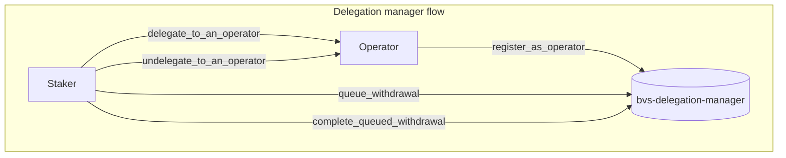

# BVS Delegation Manager

The `bvs-delegation-manager` is used to manage delegation and undelegation of Stakers to Operators.
Its primary features are to allow Operators to register on-chain as Operators (`registerAsOperator`),
to keep track of shares being delegated to Operators across different strategies,
and to manage withdrawals on behalf of the `bvs-strategy-manager`.

This means that each time a Staker's balance changes in either the `bvs-strategy-manager`,
the `bvs-delegation-manager` is called to record this update to the Staker's delegated Operator (if they have one).
For example, if a Staker is delegated to an Operator and deposits into a strategy, the `bvs-strategy-manager`
will call the `bvs-delegation-manager` to update the Operator's delegated shares for that strategy.

## Workflow

1. Register as operator.
2. Staker delegates/undelegates to a registered operator.
3. Staker initiates a withdrawal of their deposit shares.
4. After withdrawal delay, completes the specified withdrawal as shares or tokens.

