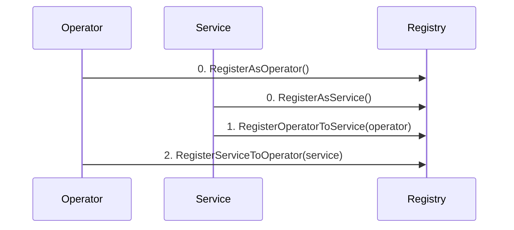

# BVS Registry

The BVS Registry is a central record-keeping contract for all Operators and Services within the SatLayer ecosystem.
It acts as a directory for all Operators and Services to register themselves and establish relationships with each other.
Operators and Services are registered in the registry contract, and their metadata is emitted as events.

This contract provides the bookkeeping registry for `vault-router` to query delegations to determine if the Operator
is validating a Service.
This allows the `vault-router` to make vault management decisions based on the
delegations (queue funds withdrawal from the Vault if delegated).

## Operator/Service Registration

An Operator/Service (sender) can register a Service/Operator to run and vice versa.
However, both the Operator and Service must register to each other to establish a relationship.

- As an Operator, by registering a Service, you are indicating that you are willing to run the Service.
- As a Service, by registering an Operator, you are indicating that you are willing to be run by the Operator.

