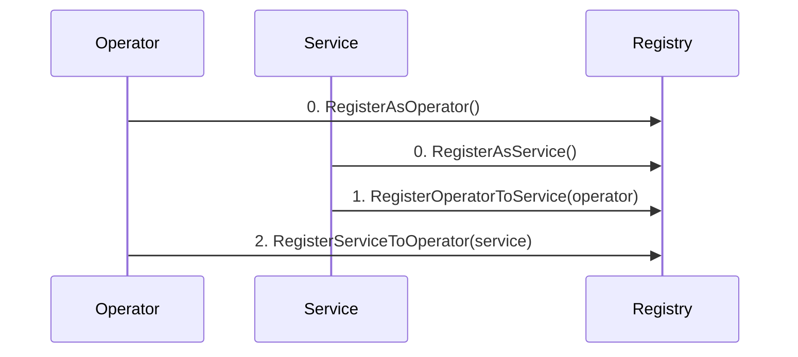

# BVS Registry

The BVS Registry is a central record-keeping contract for all Operators and Services within the SatLayer ecosystem.
It serves as a directory where Operators and Services can register themselves and establish mutual relationships.

The BVS Registry provides essential bookkeeping for the `vault-router` to query delegations and determine
if an Operator is validating a Service.
This enables the `vault-router` to make informed vault management decisions,
such as queuing funds withdrawal from the Vault when delegated.

- **Operator and Service Registration**: Allows addresses to register as Operators or Services
- **Bidirectional Relationships**: Establishes mutual connections between Operators and Services
- **Metadata Management**: Supports optional metadata (name, URI) for Operators and Services
- **Status Tracking**: Tracks the registration status between Operators and Services
- **Event-Based Metadata**: Emits metadata as events rather than storing it on-chain
- **Delegation Information**: Provides critical data for vault management decisions

## Contract Functions

### Registration Functions

- `RegisterAsService`: Register an address as a Service with optional metadata
- `RegisterAsOperator`: Register an address as an Operator with optional metadata
- `RegisterOperatorToService`: Service registers an Operator to run it
- `RegisterServiceToOperator`: Operator registers a Service it's willing to run

### Metadata Management

- `UpdateServiceMetadata`: Update a Service's metadata (name, URI)
- `UpdateOperatorMetadata`: Update an Operator's metadata (name, URI)

### Deregistration Functions

- `DeregisterOperatorFromService`: Service removes an Operator
- `DeregisterServiceFromOperator`: Operator removes a Service

### Query Functions

- `Status`: Check registration status between a Service and Operator
- `IsService`: Check if an address is registered as a Service
- `IsOperator`: Check if an address is registered as an Operator
- `IsOperatorActive`: Check if an Operator has active Service registrations

## Registration Process

An Operator/Service can register a Service/Operator to run and vice versa. However, both the Operator and Service must register to each other to establish an active relationship.

- As an Operator, registering a Service indicates willingness to run that Service
- As a Service, registering an Operator indicates willingness to be run by that Operator

### Registration Sequence

