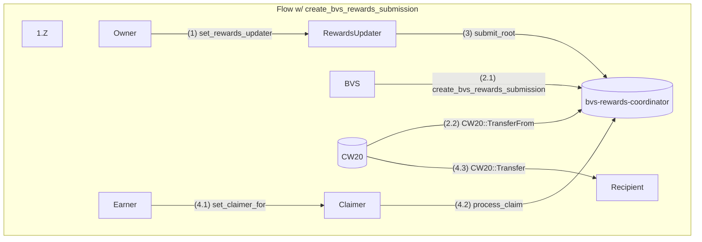
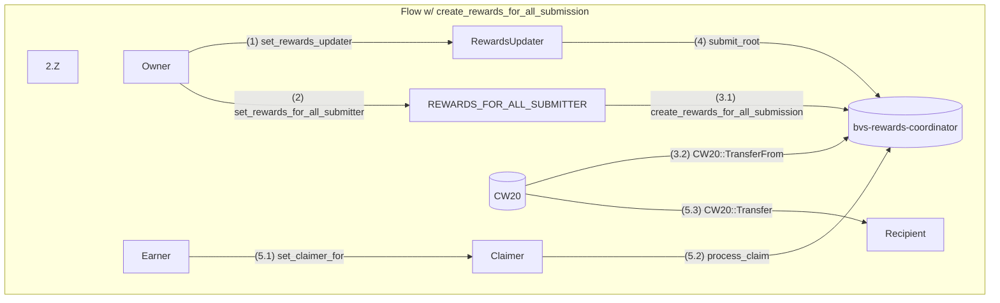

# BVS Rewards Coordinator

`bvs-rewards-coordinator` is responsible for holding the rewards from BVS and distributing them to the earners.

## General Flow

`Owner` sets the `RewardsUpdater` as init process.

`BVS` computes rewards off-chain, creates a reward merkle tree where the leaves are the rewards for each `Earner`.
The root of the merkle tree is passed to `RewardsUpdater`.

`BVS` also transfers the rewards (CW20 tokens) to `bvs-rewards-coordinator` contract through `create_bvs_rewards_submission` or proxy through setting `REWARDS_FOR_ALL_SUBMITTER`.

The `RewardsUpdater` submits the root of the rewards merkle tree to the `bvs-rewards-coordinator`.

The `Earner` sets the `Claimer` for their rewards, which could be themselves (`Claimer = Earner`) or not.

The `Claimer` calls `process_claim` with the reward root to claim, leaf and merkle proof.
This can only be done after the root is submitted + `activation_delay`.
Then `bvs-rewards-coordinator` transfers the rewards to the `Recipient` (passed in `process_claim` param).

