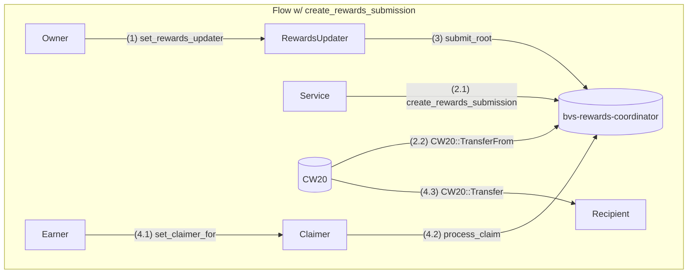

# BVS Rewards Coordinator

`bvs-rewards-coordinator` is responsible for holding the rewards from BVS and distributing them to the earners.

## General Flow

1. **Initial Setup**:

   - `Owner` configures `RewardsUpdater`

2. **Rewards Submission**:

   - `Service` calculates off-chain rewards for each `Strategy`
   - Sends tokens to contract via `create_rewards_submission`

3. **Rewards Activation**:

   - `RewardsUpdater` processes `RewardsSubmission` events periodically
   - Creates a cumulative rewards merkle tree with `(earner, token)` pairs
   - Submits root via `submit_root`

4. **Claiming Process**:
   - (optional) `Earner` designates a `Claimer`
   - `Claimer` executes `process_claim` with merkle proof after activation delay
   - Contract transfers rewards to specified `Recipient`

