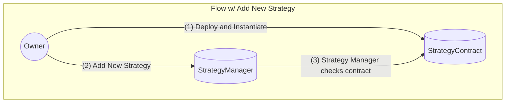
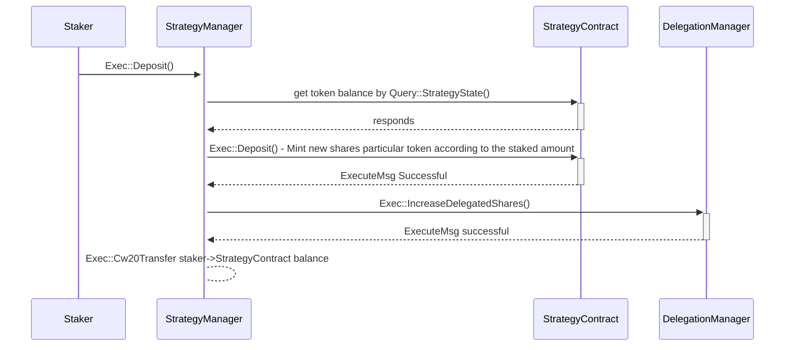
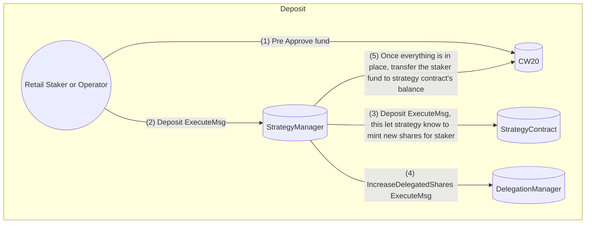
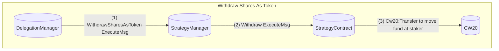
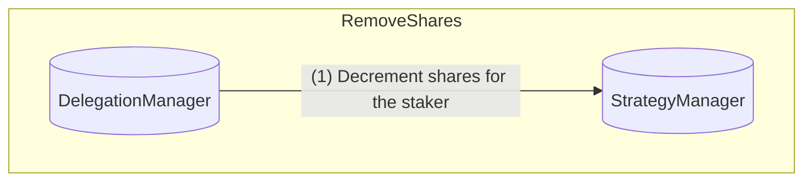

# BVS Strategy Manager

The **BVS Strategy Manager** contract is responsible for managing staking strategies, token deposits, and withdrawals.
It provides access control mechanisms for ownership and delegation management.
This document details all the **Execute** and **Query** APIs available for interaction with the contract.

## Execute APIs

The `ExecuteMsg` enum defines actions that modify the contract state.

### AddStrategy

This function allows the contract owner to add a new staking strategy.
A strategy is linked to a specific token and must be properly initialized before being added.
If a strategy is already registered for a given token, it cannot be added again.

**Parameters:**

- `strategy: Addr`: The address of the strategy contract that has been deployed and initiated beforehand.
- `whitelisted: boolean`: A flag indicating whether the strategy is approved for deposits.

Only the contract owner has permission to call this function.
On successful execution, an event `StrategyUpdated` is emitted.

### UpdateStrategy

This function allows the contract owner to update an existing strategy.

**Parameters:**

- `strategy: Addr`: The address of the strategy contract that has been deployed and initiated beforehand.
- `whitelisted: boolean`: A flag indicating whether the strategy is approved for deposits.

Only the contract owner has permission to call this function.
On successful execution, an event `StrategyUpdated` is emitted.

### DepositIntoStrategy

This function allows users to deposit tokens into a strategy's address and in turn call the strategy deposit function.
The strategy's deposit function will mint the shares according to the number of tokens deposited.
The key difference between the deposit function in the strategy and this function is
that this function does the actual transfer of token into the strategy contract's address.
The strategy's deposit function only does the minting of shares and increments its total shares.

**Parameters:**

- `strategy`: Address of the strategy receiving the deposit.
- `token`: Address of the token being deposited.
- `amount`: The number of tokens to deposit.

After a successful deposit, the user receives strategy shares. A corresponding event is emitted.

Sequence Diagram:

Flowchart:

### WithdrawSharesAsTokens

Users can withdraw their strategy shares as tokens using this function.
The withdrawal is processed by interacting with the strategy contract.

**Parameters:**

- `recipient`: The address that will receive the withdrawn tokens.
- `strategy`: Address of the strategy.
- `shares`: The number of shares to withdraw.
- `token`: The token address corresponding to the withdrawal.

Only the delegation manager can call this function. A transaction is executed to process the withdrawal.

### AddShares

The delegation manager assigns shares to a staker in a specific strategy.
Shares represent the user's stake in the strategy.

**Parameters:**

- `staker`: Address of the staker.
- `strategy`: Strategy contract address.
- `shares`: The number of shares to assign.

An `add_shares` event is emitted when the function executes successfully.

### RemoveShares

This function allows the delegation manager to remove shares from a staker's balance in a given strategy.

**Parameters:**

- `staker`: Address of the staker.
- `strategy`: Address of the strategy.
- `shares`: The number of shares to remove.

If all shares are removed, the strategy is also removed from the staker's list. An event is emitted upon execution.

## Query APIs

The `QueryMsg` enum allows for retrieving contract state.

### GetDeposits

Retrieves the deposit information for a staker.

**Parameters:**

- `staker`: Address of the staker.

Returns a list of strategies and corresponding shares.

### StakerStrategyListLength

Returns the number of strategies a staker is participating in.

### GetStakerStrategyShares

Retrieves the number of shares a staker has in a specific strategy.

### GetStakerStrategyList

Returns a list of all strategies a staker is involved with.
