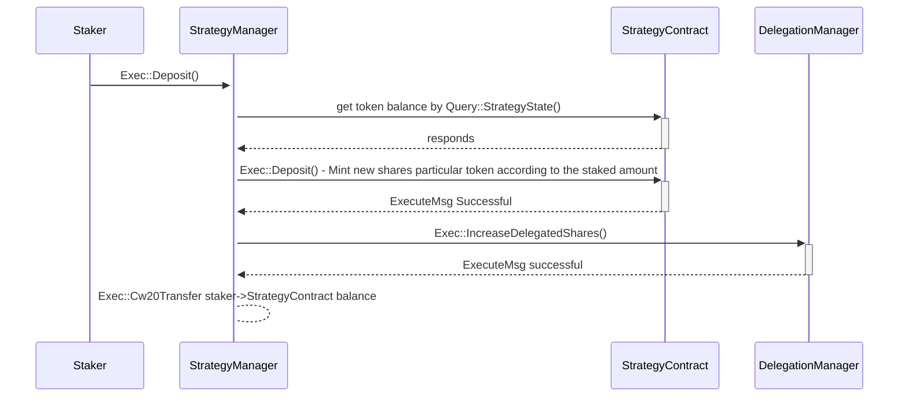

# BVS Strategy Manager

The **BVS Strategy Manager** contract is responsible for managing staking strategies, token deposits, and withdrawals. It provides access control mechanisms for ownership and delegation management. This document details all the **Execute** and **Query** APIs available for interaction with the contract.

---

## Execute APIs

The `ExecuteMsg` enum defines actions that modify the contract state.

### AddNewStrategy

This function allows the contract owner to add a new staking strategy. A strategy is linked to a specific token and must be properly initialized before being added. If a strategy is already registered for a given token, it cannot be added again. Once added, the strategy is automatically whitelisted for deposits. Subsequent whitelisting actions can only be done by the whitelister.

**Parameters:**

- `new_strategy`: The address of the strategy contract that has been deployed and initiated before hand.
- `token`: The address of the token to be associated with the strategy.

Only the contract owner has permission to call this function. On successful execution, an event `NewStrategyAdded` is emitted.

### BlacklistTokens

This function blacklists specified tokens, preventing them from being deposited into strategies. If a token is already blacklisted, the function returns an error. If a token has an associated strategy, that strategy is also removed from the deposit whitelist.

**Parameters:**

- `tokens`: A list of token addresses to be blacklisted.

Only the designated strategy whitelister can execute this function. A `TokenBlacklisted` event is emitted upon success.

### AddStrategiesToWhitelist

This function allows the strategy whitelister to approve strategies for deposits. Only whitelisted strategies can receive deposits from users.

**Parameters:**

- `strategies`: A list of strategy contract addresses to be added to the whitelist.

Once a strategy is added, a `StrategyAddedToDepositWhitelist` event is emitted.

### RemoveStrategiesFromWhitelist

This function removes specified strategies from the deposit whitelist. Once removed, these strategies will no longer be able to receive deposits from users.

**Parameters:**

- `strategies`: A list of strategy contract addresses to be removed from the whitelist.

This function can only be called by the strategy whitelister. A `StrategyRemovedFromDepositWhitelist` event is emitted upon execution.

### SetStrategyWhitelister

The contract owner can use this function to set a new strategy whitelister. This address will have permission to add or remove strategies from the deposit whitelist.

**Parameters:**

- `new_strategy_whitelister`: The address of the new strategy whitelister.

A `set_strategy_whitelister` event is emitted upon success.

### DepositIntoStrategy

This function allows users to deposit tokens into a strategy's address and in turns call the strategy.deposit functioin. The strategy's deposite function will mint the shares according to the amount of tokens deposited. The key difference between depoist function in the strategy and this function is that this function does the actual transfer of token into the strategy contract's address. The strategy's deposit function only does the minting of shares and increment its total shares.
**Parameters:**

- `strategy`: Address of the strategy receiving the deposit.
- `token`: Address of the token being deposited.
- `amount`: The amount of tokens to deposit.

After a successful deposit, the user receives strategy shares. A corresponding event is emitted.

### WithdrawSharesAsTokens

Users can withdraw their strategy shares as tokens using this function. The withdrawal is processed by interacting with the strategy contract.

**Parameters:**

- `recipient`: The address that will receive the withdrawn tokens.
- `strategy`: Address of the strategy.
- `shares`: The number of shares to withdraw.
- `token`: The token address corresponding to the withdrawal.

Only the delegation manager can call this function. A transaction is executed to process the withdrawal.

### AddShares

The delegation manager assigns shares to a staker in a specific strategy. Shares represent the user’s stake in the strategy.

**Parameters:**

- `staker`: Address of the staker.
- `token`: Token address related to the stake.
- `strategy`: Strategy contract address.
- `shares`: The number of shares to assign.

An `add_shares` event is emitted when the function executes successfully.

### RemoveShares

This function allows the delegation manager to remove shares from a staker’s balance in a given strategy.

**Parameters:**

- `staker`: Address of the staker.
- `strategy`: Address of the strategy.
- `shares`: The amount of shares to remove.

If all shares are removed, the strategy is also removed from the staker’s list. An event is emitted upon execution.

### TransferOwnership

Ownership of the contract can be transferred using this function.

**Parameters:**

- `new_owner`: Address of the new contract owner.

The function updates the owner field and emits an event.

### SetRouting 

This function configure the slash manager and delegation manager for the strategy manager.

**Parameters:**
- `slash_manager`: Address of the slash manager.
- `delegation_manager`: Address of the delegation manager.

---

## Query APIs

The `QueryMsg` enum allows for retrieving contract state.

### GetDeposits

Retrieves the deposit information for a staker.

**Parameters:**

- `staker`: Address of the staker.

Returns a list of strategies and corresponding shares.

### StakerStrategyListLength

Returns the number of strategies a staker is participating in.

### GetStakerStrategyShares

Retrieves the number of shares a staker has in a specific strategy.

### GetStakerStrategyList

Returns a list of all strategies a staker is involved with.

### Owner

Returns the current contract owner.

### IsStrategyWhitelisted

Checks if a given strategy is whitelisted for deposits.

### GetStrategyManagerState

Retrieves the state of the strategy manager, including delegation manager and slash manager information.
