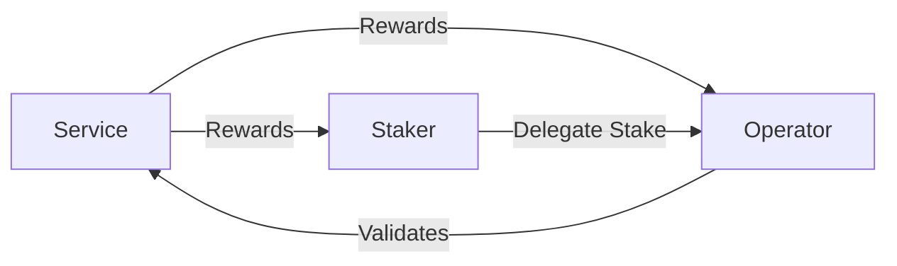

import {Callout} from "nextra/components";

# Rewards

Rewards are the economic incentives
provided by [Services](/getting-started/services) to [Operators](/getting-started/operators) and Stakers for their participation
in securing the Service network.

## Participants in the Rewards System

<Callout>
    In the SatLayer ecosystem, **Operators** and **Stakers** are collectively referred to as **Earners** when discussing the rewards distribution process.
</Callout>

- **Operators** run the infrastructure and validation systems
- **Stakers** delegate their assets to Operators as part of the shared security model
- **Services** distribute rewards to both parties based on their contributions

## Rewards Workflow

### Distributing Rewards

The rewards distribution process follows these steps:

1. **Calculate Rewards**
- Services calculate rewards for each Earner based on their own criteria
- These calculations are recorded in a `distribution.json` file
that follows the [schema](https://github.com/satlayer/satlayer-rewards/blob/main/schema/distribution.schema.json)
- The file tracks **accumulative** rewards for each Earner

2. **Submit Distribution Data**
- Services can submit their `distribution.json` file to the [`satlayer-rewards`](https://github.com/satlayer/satlayer-rewards) repository as a PR
- GitHub Actions automatically generate and store the merkle tree in the repository
- This step simplifies the proof generation process for Earners
- Services can also generate the merkle root locally using the CLI from `@satlayer/cli`

3. **Execute Distribution**
- Services call `DistributeRewards` on the [`bvs-rewards`](/contracts/rewards) contract with the generated merkle root
- Before execution, Services must ensure that:
    - The reward tokens are available in sufficient amounts
    - Appropriate allowances are granted to the [`bvs-rewards`](/contracts/rewards) contract

### Claiming Rewards

Earners can claim their rewards through this process:

1. **Generate Proofs**
- Earners use `@satlayer/cli` to generate proofs
- Proofs are specific to each Service and token pair the Earner wishes to claim

2. **Execute Claim**
- Earners call `ClaimRewards` on the [`bvs-rewards`](/contracts/rewards) contract
- The call includes the merkle proof, leaf index, and other required parameters

<Callout type="info">
    For detailed examples of claim request parameters and code samples, please refer to the
    [SatLayer Rewards CLI documentation](https://github.com/satlayer/satlayer-rewards).
</Callout>