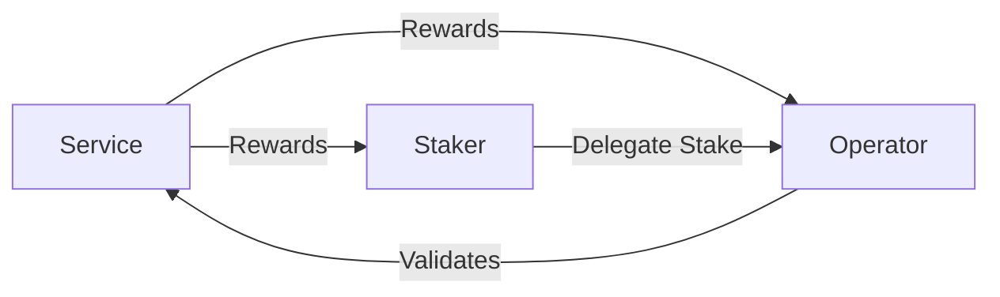

import {Callout, Steps} from "nextra/components";

# Distributing Rewards

Rewards are the economic incentives
provided by [Services](/getting-started/services) to [Operators](/getting-started/operators) and Stakers for their participation
in securing the Service network.

BVS applications are expected to distribute their tokens as rewards to Bitcoin restakers who provide 
collateral for cryptoeconomic security, and operators who help with the validation.

To ensure a robust amount of Bitcoin assets for security and proper operator functioning, BVSs
must reward good behavior in the form of payments made to restakers and operators. The following
section explains how these payments work.

## Participants in the Rewards System

<Callout>
    In the SatLayer ecosystem, **Operators** and **Stakers** are collectively referred to as **Earners** when discussing the rewards distribution process.
</Callout>

In general, we have the following participants:

- **Operators** run the infrastructure and validation systems for the Services
- **Stakers** delegate their assets to Operators as part of the shared security model
- **Services** distribute rewards to both parties based on their contributions

## Rewards Workflow

### Distributing Rewards

In the following sections, we will outline the steps for Services to distribute rewards to Earners,
and for Earners to claim their rewards. The rewards distribution process follows these steps:
 
<Steps>

### Calculate rewards
 
Services should calculate rewards for each Earner based on their own criteria.
These calculations are recorded in a `distribution.json` file
that follows the [schema on the SatLayer GitHub](https://github.com/satlayer/satlayer-rewards/blob/main/schema/distribution.schema.json).
The file tracks **accumulative** rewards for each Earner.
 
### Submit distribution data

Services can submit their `distribution.json` file to the [`satlayer-rewards`](https://github.com/satlayer/satlayer-rewards) repository as a PR,
there are GitHub Actions configured that automatically generate and store the merkle tree in the repository.
This step simplifies the proof generation process by Services for Earners.
Should Services prefer, the merkle root can also be generated locally using the CLI from `@satlayer/cli`.

### Execute the distribution

Services should call the `DistributeRewards` function on the [`bvs-rewards`](/contracts/rewards) contract
with the generated merkle root, in order to distribute the rewards.

Before executing this step, Services must ensure that:
- The reward tokens are available in sufficient amounts
- Appropriate allowances are granted to the [`bvs-rewards`](/contracts/rewards) contract

</Steps>

### Claiming Rewards

<Callout type="info">
    For detailed examples of claim request parameters and code samples, please refer to the
    [SatLayer Rewards CLI documentation](https://github.com/satlayer/satlayer-rewards).
</Callout>

Earners can claim their rewards through this process:

<Steps>

### Generate proofs

Earners use the `@satlayer/cli` to generate proofs for their rewards. 
These proofs are specific to each Service and token pair the Earner wishes to claim rewards for.
In reality, there may be a user interface that allows Earners to generate proofs without needing to use the CLI directly.

### Execute claim

Earners call the `ClaimRewards` function on the [`bvs-rewards`](/contracts/rewards) contract.
This call includes the merkle proof, leaf index, and other required parameters.
When the claim is successful, the Earners receive their rewards in the specified token as distributed by the Service.

</Steps>
