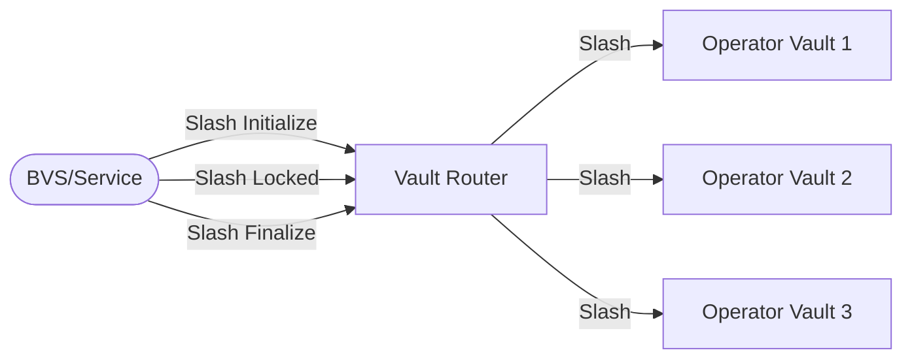

import {Callout} from "nextra/components";

# Programmable Slashing

<Callout type="info">
This is technical documentation for BVS developers and operators. The terms BVS and service are used interchangeably in this document.
</Callout>


```txt
                                           SlashParameters(service)                               
        RegisterAsService ┌────────┐       Status(operator,service)                              
          ┌──────────────►│Registry│◄────────────────┐                               
          │               └────────┘                 │
          │                                          │                               
          │                                          │                               
          │                                          │                               
          │                                          │               ┌──────────┐    
          │                                          │           ┌───┤OP Vault 1│    
          │         ┌──1.Slash Initialize─┐          │           │   └──────────┘    
    ┌───────────┐   │                     │    ┌─────┴──────┐    │   ┌──────────┐    
    │BVS/Service│───┼──2.Slash Locked─────┼───►│Vault Router│◄───┼───┤OP Vault 2│    
    └───────────┘   │                     │    └────────────┘    │   └──────────┘    
                    └──3.Slash Finalize───┘                      │   ┌──────────┐    
                                                                 └───┤OP Vault 3│    
                                                                     └──────────┘   
```
> A Service slashes a proportional amount in all Vaults operated by an Operator.
> A Service can be an Operator and a Service simultaneously—this is a use case for insurance services.

Each BVS is responsible for preparing, executing, and finalizing slashing operations.
It interacts with the Vault Router (coordinator of vaults, the entry point into vaults) to execute the slashing process across multiple operator vaults.
The flowchart illustrates the sequence of events in the slashing lifecycle,
starting from the preparation phase to the finalization phase.
Each phase is time-delayed to ensure that the slashing process is executed with fair notice,
allowing the operator to respond.

Funds are only moved during the `slash_locked` phase, from the operator vaults to the jail.
The restakers (and stakers) are unaffected until the slashing process reaches the `slash_locked` phase.
Guardrails are in place to prevent malicious slashing before the finalization phase.

## Enable Slashing

To enable slashing, the service must first call `enable_slashing` in the Registry contract.
This can be done during the contract initialization or anytime after the contract is deployed.

Enabling or updating the slashing configuration does not automatically enable the operator to be slashed with the new configuration.
The operator must explicitly agree to the new slashing configuration by calling `operator_opt_in_to_slashing` again. This ensures that the operator knows and has agreed to the new slashing conditions—a guardrail to prevent the spontaneous slashing of operators due to a malicious change of service operating posture.

The `resolution_window` is the amount of seconds, the operator has to respond to resolve the slashing incident.
The slashing window will automatically close after `resolution_window * 2` has elapsed.

```json
{
  "enable_slashing": {
    "destination": "bbn...",
    "max_slashing_bips": 0.5,
    "resolution_window": 86400
  }
}
```

## Slashing Initiator

The slashing initiator is the same address as the service (sender of `register_service` in the Registry contract).
This sender can be the EOA or governance contract of the service;
SatLayer does not restrict this to facilitate any service architecture.

The slashing implementation can be a collection of contracts, a single contract, or even an EOA.
If needed, a request to slash governance can be proxied through the service to initiate the slashing.
The slashing can be initiated as long as the slashing initiator is the same address as the service.

A contract should govern the service for objectively verifiable slashing (e.g., optimism fault proof).
This allows trustless senders on the chain to initiate slashing with objective proof of the fault.
However, if necessary,
an EOA can govern the service for arbitrary slashing or conditions that are not objectively verifiable.

**When can slashing be initiated?**

* An operator must be actively validating the service at the time of the accusation.
The `query::status` must return `Active` in the Vault Router; we use checkpoints to determine the historic state.
* Pending slashes must be canceled before a new slashing process can be initiated.
In-progress slashing will be automatically canceled after the maximum `resolution_window * 2` expires.
* The operator must opt into the slashing parameters provided by the service.
If the service has enabled slashing before the operator has registered with the service,
the operator will automatically opt in during registration.

## Slashing Lifecycle

The service (BVS) governs the conditions for slashing, which the BVS developer can fully program.
The lifecycle of slashing coordinated through the Vault Router is entirely agnostic to the condition and reason for slashing.
The Vault Router is a coordinator and enforces latency constraints to allow the operator to respond.

**A slashing operation is bounded between a Service and an Operator.**
A service can actively slash multiple distinct operators at the same time.
Multiple services can also slash an operator at the same time.
An operator and service pair can only be slashed once every 48 hours.



---
<Callout>
  Check back soon! Documentation is a work in progress.
</Callout>