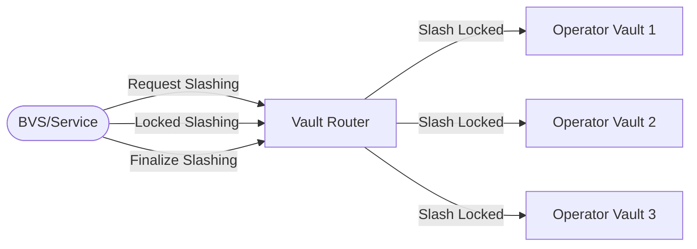

import {Callout} from "nextra/components";

# Programmable Slashing

<Callout type="info">
This is technical documentation for BVS developers and operators. The terms BVS and service are used interchangeably in this document.
</Callout>


```txt
                                           SlashingParameters(service)
        RegisterAsService ┌────────┐       Status(operator,service)                              
          ┌──────────────►│Registry│◄────────────────┐                               
          │               └────────┘                 │
          │                                          │                               
          │                                          │                               
          │                                          │                               
          │                                          │               ┌──────────┐    
          │                                          │           ┌───┤OP Vault 1│    
          │         ┌──1.Request Slashing ─┐         │           │   └──────────┘
    ┌───────────┐   │                      │   ┌─────┴──────┐    │   ┌──────────┐
    │BVS/Service│───┼──2.Locked Slashing───┼──►│Vault Router│◄───┼───┤OP Vault 2│
    └───────────┘   │                      │   └────────────┘    │   └──────────┘
                    └──3.Finalize Slashing─┘                     │   ┌──────────┐
                                                                 └───┤OP Vault 3│    
                                                                     └──────────┘   
```
> A Service slashes a proportional amount in all Vaults operated by an Operator.
> A Service can be an Operator and a Service simultaneously—this is a use case for insurance services.

Each BVS is responsible for preparing, executing, and finalizing slashing operations.
It interacts with the Vault Router (coordinator of vaults, the entry point into vaults) to execute the slashing process across multiple operator vaults.
The flowchart illustrates the sequence of events in the slashing lifecycle,
starting from the preparation phase to the finalization phase.
Each phase is time-delayed to ensure that the slashing process is executed with fair notice,
allowing the operator to respond.

Funds are only moved during the `locked_slashing` phase, from the operator vaults to the jail.
The restakers (and stakers) are unaffected until the slashing process reaches the `locked_slashing` phase.
Guardrails are in place to prevent malicious slashing before the finalization phase.

## Enable Slashing

To enable slashing, the service must first call `enable_slashing` in the Registry contract.
This can be done during the contract initialization or anytime after the contract is deployed.

Enabling or updating the slashing configuration does not automatically enable the operator to be slashed with the new configuration.
The operator must explicitly agree to the new slashing configuration by calling `operator_opt_in_to_slashing` again. This ensures that the operator knows and has agreed to the new slashing conditions—a guardrail to prevent the spontaneous slashing of operators due to a malicious change of service operating posture.

The `resolution_window` is the amount of seconds, the operator has to respond to resolve the slashing incident.
The slashing window will automatically close after `resolution_window` + 7 days have elapsed.

```json
{
  "enable_slashing": {
    "parameters": {
      "destination": "bbn...",
      "max_slashing_bips": 0.5,
      "resolution_window": 86400
    }
  }
}
```

## Slashing Initiator

The slashing initiator is the same address as the service (sender of `register_service` in the Registry contract).
This sender can be the EOA or governance contract of the service;
SatLayer does not restrict this to facilitate any service architecture.

The slashing implementation can be a collection of contracts, a single contract, or even an EOA.
If needed, a request to slash governance can be proxied through the service to initiate the slashing.
The slashing can be initiated as long as the slashing initiator is the same address as the service.

A contract should govern the service for objectively verifiable slashing (e.g., optimism fault proof).
This allows trustless senders on the chain to initiate slashing with objective proof of the fault.
However, if necessary,
an EOA can govern the service for arbitrary slashing or conditions that are not objectively verifiable.

**When can slashing be initiated?**

* An operator must be actively validating the service at the time of the accusation.
The `query::status` must return `Active` in the Vault Router; we use checkpoints to determine the historic state.
* Pending slashes must be canceled before a new slashing process can be initiated.
In-progress slashing will be automatically canceled after the maximum `resolution_window` + 7 days expire.
* The operator must opt into the slashing parameters provided by the service.
If the service has enabled slashing before the operator has registered with the service,
the operator will automatically opt in during registration.

## Slashing Lifecycle

The service (BVS) governs the conditions for slashing, which the BVS developer can fully program.
The lifecycle of slashing coordinated through the Vault Router is entirely agnostic to the condition and reason for slashing.
The Vault Router is a coordinator and enforces latency constraints to allow the operator to respond.

**A slashing operation is bounded between a Service and an Operator.**
A service can actively slash multiple distinct operators at the same time.
Multiple services can also slash an operator at the same time.
An operator and service pair can only be slashed once every 48 hours.



### Request Slashing 

The first step in the slashing lifecycle prepares the process
by gathering necessary information and setting up the conditions for slashing.
The service fires off a `request_slashing` message to the Vault Router to initiate the slashing process. 

* Slash can be requested for events 7 days before the current time of the transaction. 
A service should slash at the earliest opportunity,
as unnecessary latency will increase the opportunity for vault restakers to move assets to prevent dilution.
* Only a proportion of the vaults will be slashed based on provided `bips`.
* A `reason` is required to explain why the slashing is being executed; 
this must be a human-readable string and informative to understand why an operator is being slashed. 
* A slash identifier (calculated hash of the service address and message payload) will be returned; 
this is used for the next steps in the slashing lifecycle. 

Behind the scenes,
executing `request_slashing` on the Vault Router will check the registration status of the operator to service at the timestamp and the registered slashing parameters
that the operator has opted into.
Suppose the operator has opted into a set of slash parameters previously without opting into the new set of parameters.
In that case, the service can only slash with the previous set of parameters.

```json
{ 
  "request_slashing": {
    "operator": "bbn...",
    "bips": 50,
    "timestamp": 1555555555,
    "metadata": {
      "reason": "Service is not up."
    }
  }
}
```

### Cancel Slashing (resolved)

After the `request_slashing` message is sent, the operator has a `resolution_window` (in seconds) to respond.
The service sets this window and can be any value.
Zero is a valid value for objectively verifiable slashing.
**A value greater than the withdrawal delay is not recommended**.
If promptly responded to and resolved, the service can cancel the slashing process.

The service (slash initiator) should cancel the slashing process if the operator has resolved the issue.
The definition of "resolved" is up to the service to define.
For objectively verifiable faults,
e.g., double-signing or computationally verifiable, it's up to the service to define whether it can be canceled or not.
For time-based faults, e.g., uptime SLA, the service should define a time window for the operator to resolve the issue.

Programmable slashing is ultimately a flexible mechanism for shared security.
Services and operators should work harmoniously to ensure the best possible outcome for all parties involved.
Egregiously slashing the operator is not the goal of this mechanism,
and operators can choose to deregister from the service if they feel the service is not acting in good faith.

A service cannot start a new slashing process until the current one is canceled or executed
(for more information, see Slashing Lifecycle to understand the entity relationship between operators and services).
Unexecuted slashing will expire after the `resolution_window` + 7 days
and be canceled after a new request for the same (service, operator) pair is submitted.

```json
{
  "cancel_slashing": {
    "id": 1
  }
}
```

### Locked Slashing

After the `request_slashing` message is sent, the operator has a `resolution_window` (in seconds) to respond.
If the operator does not respond or fails to resolve the issue within the `resolution_window`,
the service will execute the slash and move the funds from the operator vaults to the locked state. 

After executing the slash by moving and locking up the assets in the Vault Router,
the Vault Router will rebase all affected vaults to reflect the new exchange rate.
New deposits will mint a higher share ratio and will not be affected by the slashing.

```json
{ 
  "locked_slashing": {
    "id": 1
  }
}
```

### Finalize Slashing

Post-execution, the slashing process must be finalized to move the funds from the locked state to the final destination,
which is determined by the service through the `slashing_parameters` in the Registry contract.
The finalization phase represents the conclusive step in the slashing lifecycle,
where the locked funds are permanently transferred to the designated recipient address.

```json
{ 
  "finalize_slashing": {
    "id": 1
  }
}
```

A slash can only be finalized
after it has passed the guardrail checks
implemented through a governance mechanism in Phase 2. This critical safeguard ensures
that slashing actions are legitimate,
proportional,
and aligned with the ecosystem's best interests.

**Guardrails: Securing the Slashing Lifecycle in Phase 2**

The Guardrails system is a security mechanism that governs the Slashing Lifecycle
and protects the ecosystem from potential exploitation.
This system will evolve from a trusted model to a fully trustless and decentralized security framework in later phases.

The slashing process is currently (Phase 2)
secured through a trusted governance voting mechanism involving the contract administrators,
technical operators, and services.
This committee reviews slashing actions before finalization, verifying their legitimacy,
assessing proportionality, and preventing potential ecosystem harm.

When a slashing action reaches finalization,
the committee evaluates it and can block actions deemed unjustified or disproportionate.
The system will gradually transition toward a more decentralized model with expanded participation,
objective verification criteria, transparent governance processes, and aligned economic incentives.

This evolution reduces centralization risks, enhances security through distributed responsibilities,
increases legitimacy through transparent governance, and creates a scalable framework for ecosystem growth.
Implementing these guardrails balances immediate security needs with long-term decentralization goals,
creating a robust foundation for sustainable ecosystem growth.