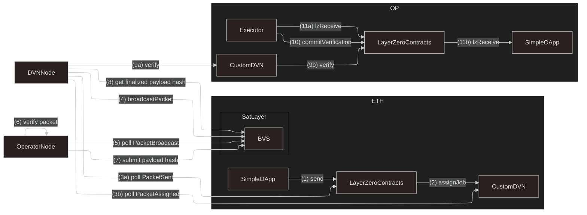

# LayerZero DVN Example (EVM control plane)

This example demonstrates how to build DVN + BVS integration with LayerZero for cross-chain packet verification
and broadcasting leveraging on SatLayer's BVS ecosystem in EVM control plane.

For CW control plane, see [layerzero-dvn](https://github.com/satlayer/satlayer-bvs/tree/main/examples/cw/layerzero-dvn).

Typically, each DVN is responsible for verifying packets in LayerZero ecosystem,
by integrating BVS ecosystem in SatLayer, we can leverage cryptoeconomic incentives to secure the verification process.

## Overview

For this example we will build a simple message passing OApp
(`SimpleOApp.sol`) that sends a message packet from eth mainnet to optimism mainnet using custom DVN (`CustomDVN.sol`) and BVS (`BVS.sol`) integration.

### On-chain contracts

#### `CustomDVN`

- An EVM contract to be deployed on Source (ETH) and Destination chains (OP) that implements LayerZero DVN interface.
- It will be the entry point to LZ core contracts for sending and receiving packets.

#### `SimpleOApp`

- An EVM contract that implements LayerZero OApp interface to send and receive packets cross-chain.
- Uses custom routing logic that sends packets through `CustomDVN` for verification.

#### `BVS`

- An EVM contract that acts as a BVS
- It will broadcast packets received from `CustomDVN` to the BVS ecosystem on SatLayer.
- The Operators will listen for broadcasted packets and verify them, submitting the payload hash to the BVS contract.
- Through Quorum, the BVS contract will ensure that the packet is verified by a sufficient number of operators before finalizing it.
- NOTE: this contract is kept simple for demonstration purposes, in production you would want to use a more robust BVS contract.

### Off-chain nodes

#### `DVNNode`

- An off-chain node that integrates `CustomDVN` with `bvs-dvn-contract`.
- It listens for `PacketSent` events from LZ `EndpointV2` and `PacketAssigned` events from `CustomDVN` and then broadcast the relevant packets to `BVS`.
- It also finalizes the payload hash when the quorum of operators has verified the packet.

#### `OperatorNode`

- An off-chain node that listens for broadcasted packets from `BVS`.
- It verifies the packet (i.e., checks the signature and payload)
- It produces payload hash and submits it to the `BVS` as a proof that it has verified the packet.

### Project Structure

```
examples/dvn
├── src
│   ├── contracts               # Contains EVM Contracts
│   │   ├── BVS.sol             # BVS contract
│   │   ├── CustomDVN.sol       # Custom DVN contract for LayerZero integration
│   │   └── SimpleOApp.sol      # Simple OApp contract to send and receive packets cross-chain
│   ├── configHelper.ts         # Helper function for LZ OApp DVN configuration
│   ├── dvnNode.ts              # Off-chain DVN Node that integrates DVN -> BVS
│   ├── lifecycle.test.ts       # 👀 Shows the full flow of message passing using DVN + BVS
│   ├── lz.constant.ts          # Stores LZ core contracts constants
│   └── operatorNode.ts         # Off-chain Operator Node that verifies packets and submits payload hash
├── foundry.toml
├── remappings.txt
└── package.json
```

### Flow

Shows the flow found in `lifecycle.test.ts`:



## Setup

```bash
# Install dependencies
pnpm install
```

## Build

```bash
# Compile EVM contracts with Foundry.
pnpm run build
```

## Running the lifecycle test

```bash
# Install dependencies
pnpm install
# Build the project
pnpm run build
# Run the lifecycle test
pnpm run test
```

### Note

There is a minor difference in the lifecycle test between EVM and CW control plane.
These are done due to gas saving measures.
The main logic flows remain the same.
