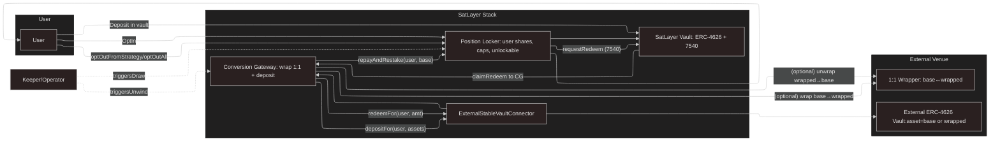

User-centric collateralization into external ERC-4626 vaults

This example shows how to let a stablecoin protocol (or any external venue) use BTC-denominated stake from SatLayer without burdening users. We implement an Embedded Position Locker (PL) inside the SatLayer vault domain and a Conversion Gateway (CG) that handles off-vault positioning.

## Key Assumptions

This example operates with a simplified model where the external venue accepts the same asset as SatLayer’s base (or a canonical 1:1 wrapped version, e.g., BTC↔WBTC). There’s no price risk on deposit/unwind, so users can redeem any amount at any time.

Other complex models, like borrowing against BTC, can be also programmed in the future.

## Overview

Operators in SatLayer are vault controllers. Each vault exposes a delegated() operator address.

The Position Locker (PL) lives alongside the vault and lets users opt-in by moving vault shares into the PL—no extra custody or approvals to third parties.

The Conversion Gateway (CG) is a small router owned by the operator/keeper that, wraps 1:1 if needed and deposits per-user into an external ERC-4626 vault through a tiny ExternalStableVaultConnector.

The Connector attributes per-user shares (not pooled debt) so a user’s entitlement = targetVault.convertToAssets(userShares), automatically including yield.

## User-centric

Users can unwind any amount, anytime. If they unwind all and the CG restakes it, their PL debt goes to zero, so they can opt-out and take back their vault shares.

Yield is tracked automatically by the external ERC-4626 vault’s share price.

## Key Assumptions

- Single operator per vault (as in SatLayer): the vault’s delegated() address is the Operator and also can act as Keeper in PL/CG.

- External venue is an ERC-4626 vault whose asset() is either:
  - the same base as SatLayer’s vault asset, or

  - a canonical 1:1 wrapper of it (e.g., WBTC via a trusted wrapper/bridge).

- Users interact only with SatLayer Vault + PL (if they want to unwind). The rest is run by the operator/keeper.

## Core Contracts

### SatLayer Vault (ERC-4626/7540)

Holds the base asset (e.g., WBTC/LST).

Exposes async redemption (ERC-7540) so PL can requestRedeem(...) and later claimRedeem(...).

Exposes delegated() for the current Operator address.

### Position Locker (PL)

Lets users opt-in by transferring vault shares into the PL and tagging them to a strategy id.

The Keeper opens async redemptions against those shares to draw base assets out when needed.

When CG sends base back, PL re-deposits into the vault and reduces per-user debtAssets.

Unlockability: users can take back any shares not encumbered by current debtAssets (+ a small buffer).

### Conversion Gateway (CG)

Optional 1:1 wrap (base→wrapped).

Deposit per-user into external ERC-4626 via ExternalStableVaultConnector.

On unwind, redeem user’s wrapped/base, unwrap 1:1 if needed, and restake to PL.

Operator/keeper calls the CG; the PL never holds external assets.

### ExternalStableVaultConnector

Thin adapter around an external ERC-4626 vault.

Keeps per-user share balances (userShares[user]), so entitlement = convertToAssets(userShares[user]).

Enforces only CG can depositFor / redeemFor.

## Flow



### Path

1. User deposits base into SatLayer Vault and receives shares.

2. User opt-in: PL pulls their shares (ERC-20) and attributes them to a strategy id.

3. Keeper draws: PL opens a 7540 request for some of the user’s shares.

4. When the request is ready, Keeper claims to CG; PL books debtAssets.

5. CG optionally wraps 1:1 (base→wrapped) and deposits per-user into the external vault via Connector.

6. To unwind, Keeper (or user via PL) calls CG: redeemFor(user) from the connector, unwrap 1:1 if needed, and repayAndRestake to PL.

7. If the user unwinds all, their debtAssets becomes 0, so they can opt-out and withdraw their vault shares.

## Roles & Trust Model

- Operator / Keeper (service): vault.delegated() address.
  - Has ROLE_KEEPER in PL & CG.

  - Triggers request/claim and unwind.

- Governance: same operator in the simple model; can set caps, pause, rotate safe components (e.g., connector target vault with same asset()).

- Users: keep custody of their vault shares inside PL; can unwind any amount on Route A and then opt-out.

## Guardrails & Notes

- Dust threshold in PL: treat tiny debtAssets ≤ dust as 0 for unlockability to avoid “stuck on 1 wei”.

- Buffer in PL’s unlockable keeps a small margin of shares to cover rounding/fees.

- Wrapper must be 1:1; CG enforces out == in or reverts (WRAP_NOT_1_TO_1, UNWRAP_SLIPPAGE).

## Setup

```bash
# Install dependencies
pnpm install
```

## Build

```bash
# Compile EVM contracts with Foundry.
forge build
```

## Running the lifecycle test

```bash
# Install dependencies
pnpm install
# Build the project
forge build
# Run the lifecycle test
forge test -vvv --match-contract StablecoinFullIntegrationTest
```

## Disclaimer

Contracts here are skeletons; audit before mainnet.
