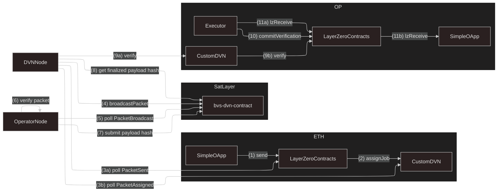

# LayerZero DVN Example

This example demonstrates how to build DVN + BVS integration with LayerZero for cross-chain packet verification
and broadcasting leveraging on SatLayer's BVS ecosystem.

Typically, each DVN is responsible for verifying packets in LayerZero ecosystem,
by integrating BVS ecosystem in SatLayer, we can leverage cryptoeconomic incentives to secure the verification process.

## Overview

For this example we will build a simple message passing OApp
(`SimpleOApp`) that sends a message packet from eth mainnet to optimism mainnet using custom DVN (`CustomDVN`) and BVS (`bvs-dvn-contract`) integration.

### On-chain contracts

#### `CustomDVN`

- An EVM contract to be deployed on Source (ETH) and Destination chains (OP) that implements LayerZero DVN interface.
- It will be the entry point to LZ core contracts for sending and receiving packets.

#### `SimpleOApp`

- An EVM contract that implements LayerZero OApp interface to send and receive packets cross-chain.
- Uses custom routing logic that sends packets through `CustomDVN` for verification.

#### `bvs-dvn-contract`

- A CosmWasm contract that acts as a BVS for the `CustomDVN` contract.
- It will broadcast packets received from `CustomDVN` to the BVS ecosystem on SatLayer.
- The Operators will listen for broadcasted packets and verify them, submitting the payload hash to the BVS contract.
- Through Quorum, the BVS contract will ensure that the packet is verified by a sufficient number of operators before finalizing it.

### Off-chain nodes

#### `DVNNode`

- An off-chain node that integrates `CustomDVN` with `bvs-dvn-contract`.
- It listens for `PacketSent` events from LZ `EndpointV2` and `PacketAssigned` events from `CustomDVN` and then broadcast the relevant packets to `bvs-dvn-contract`.
- It also finalizes the payload hash when the quorum of operators has verified the packet.

#### `OperatorNode`

- An off-chain node that listens for broadcasted packets from `bvs-dvn-contract`.
- It verifies the packet (i.e., checks the signature and payload)
- It produces payload hash and submits it to the `bvs-dvn-contract` as a proof that it has verified the packet.

### Project Structure

```
examples/dvn
├── src
│   ├── evm                     # Contains EVM Contracts
│   │   └── contracts
│   │       ├── CustomDVN.sol   # Custom DVN contract for LayerZero integration
│   │       └── SimpleOApp.sol  # Simple OApp contract to send and receive packets cross-chain
│   ├── bvs-contract            # CosmWasm contract acts as BVS for SatLayer integration
│   │   └── ...
│   ├── bvs-dvn-contract.ts     # Generated TypeScript bindings for the BVS CosmWasm contract
│   ├── configHelper.ts         # Helper function for LZ OApp DVN configuration
│   ├── dvnNode.ts              # Off-chain DVN Node that integrates DVN -> BVS
│   ├── lifecycle.test.ts       # 👀 Shows the full flow of message passing using DVN + BVS
│   ├── lz.constant.ts          # Stores LZ core contracts constants
│   └── operatorNode.ts         # Off-chain Operator Node that verifies packets and submits payload hash
├── foundry.toml
├── remappings.txt
└── package.json
```

### Flow

Shows the flow found in `lifecycle.test.ts`:



## Setup

```bash
# Install dependencies
pnpm install
```

## Build

```bash
# Compile EVM contracts with Foundry, optimize CosmWasm, and generate TS bindings
pnpm run build
```

- `build:forge`: Compiles Solidity contracts under `src/evm/contracts`.
- `build:cargo`: Build the CosmWasm contract under `src/bvs-contract`.
- `build:schema`: Generates TypeScript bindings (`bvs-dvn-contract.ts`) for the CosmWasm contract.

## Running the lifecycle test

```bash
# Install dependencies
pnpm install
# Build the project
pnpm run build
# Run the lifecycle test
pnpm run test
```

### Note

Because this example spans multiple chains, there is a need to be careful with differing chain behaviour.
For instance, in evm chains hex are normally represented with `0x` prefix, while in Cosmos chains they are not.
