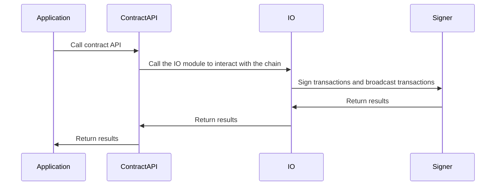
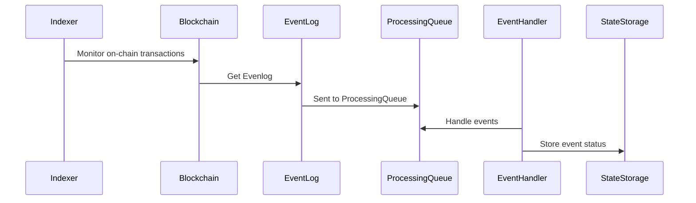

# ChainIO Module

## Overview

The ChainIO module serves as a critical component in the SatLayer architecture, acting as the interface between the application logic and the underlying blockchain infrastructure. It facilitates seamless interactions with smart contracts, handles transaction signing, and ensures the integrity of on-chain operations. This module is designed to be modular and extensible, enabling various services and applications to leverage its capabilities for efficient and secure blockchain transactions.

## Structural Design

The ChainIO module is divided into two primary workflows: **Contract API Interaction** and **Event Indexing & Processing**. Each workflow is responsible for distinct operations within the system, ensuring both proactive and reactive blockchain operations.

### Contract API Interaction

The first sequence diagram below illustrates the interaction flow between the application, contract API, IO module, and signer:

#### Key Components:

- Application: The primary application or service that initiates blockchain interactions.
- ContractAPI: A layer that abstracts the complexities of smart contract calls and interacts with the IO module.
- IO Module: Responsible for sending transactions, broadcasting them to the network, and managing communication between components.
- Signer: Handles the secure signing of transactions before broadcasting them to the blockchain.

### Event Indexing & Processing

The second sequence diagram illustrates the event indexing and processing workflow, which ensures the system remains up-to-date with on-chain events:

#### Key Components:

- Indexer: Continuously monitors blockchain transactions and detects relevant events.
- Blockchain: The underlying blockchain network from which events and logs are captured.
- EventLog: A repository for capturing and storing raw event data.
- ProcessingQueue: Queues events for processing, ensuring orderly handling of high volumes of data.
- EventHandler: Processes queued events and triggers the appropriate actions, such as updating state or triggering downstream processes.
- StateStorage: Stores processed event data, allowing for consistent state management and recovery.

## Conclusion

The ChainIO module is the backbone of on-chain and off-chain interactions within the SatLayer ecosystem. By abstracting the complexities of blockchain communication, it provides a reliable and secure interface for managing contract interactions, event processing, and transaction lifecycle management. This modular approach allows for easy integration into various applications, enabling seamless blockchain operations at scale.
