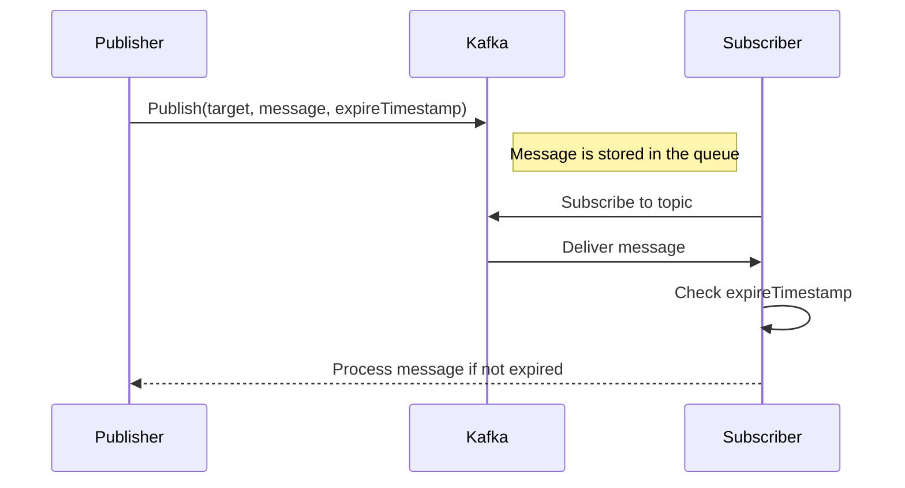

### IAC Protocol Implementation Document

#### Choosing Kafka as the Message Queue

1、Kafka provides high throughput and low latency, making it suitable for applications that need to process large amounts
of real-time messages. It can handle a large number of message flows in a short time and meet high performance requirements.

2、Kafka's design supports horizontal expansion, allowing the cluster's capacity to be expanded by adding more brokers.
As message volume grows, Kafka clusters can be easily scaled to handle more messages.

3、Kafka ensures message durability by persisting messages to disk to avoid data loss. This is important for reliable messaging, especially in the event of system failure.

4、Kafka supports different levels of message delivery guarantees, allowing you to choose the appropriate delivery guarantee for your system to ensure message reliability and consistency.

5、Kafka has a broad ecosystem and community support, offering a rich set of tools and libraries that make it easy to integrate and extend system functionality.

### kafka message expires

Option One：
The expiration and deletion of messages can be achieved through kafka configuration retention policy.

1. retention.ms: message retention time, in milliseconds. Messages older than this time will be deleted.
2. retention.bytes: Set the maximum number of bytes of logs in each partition. After reaching this size, old logs will be deleted.
3. log.retention.check.interval.ms: The interval between Kafka checking and deleting expired logs. The default is 5 minutes.

Option Two:
Users of pub and sub implement it themselves.

1. When the producer reproduces the message, it adds a field for the message expiration time.
2. When the consumer consumes messages again, it filters expired messages based on the expiration time field provided by the producer.

### kafka configuration

The configuration items of kafka are specified in docker-compose.yml

### interface definition and instantiate

```go
// The iac interface contains two methods:
// RegisterSubscriber is to register subscribers (consumer)
// Publish is to publish messages (producer). supports sending messages in batches
type IAC interface {
	RegisterSubscriber(ctx context.Context, callback func(msg string))
	Publish(ctx context.Context, msg ...Msg) error
}
// Message data structure
type Msg struct {
    // specify the hash key of Kafka load balancing, that is, the message is sent to the partition of the specified hash key.
    PartitionKey string
    // specific message content, data type is string
    Message      string
}
// Publisher instantiate
// Parameter 1 is broker (kafka server address), supports multiple
// Parameter 2 is topic (kafka queue identifier), that is, the message is the target of sending
iac.NewPublisher([]string{"localhost:19092"}, "user_click")
// Subscriber instantiate
// Parameter 1 is broker (kafka server address), supports multiple
// Parameter 2 is topic (kafka queue identifier), that is, which queue to consume messages from.
// Parameter 3 is the group to which the Subscriber belongs. Subscribers in the same group can consume all topics subscribed to by the group.
iac.NewSubscriber([]string{"localhost:19092"}, "user_click", "statistics")
```

> In most actual usage scenarios, subscription and publishing are separate logics, so when obtaining an interface instance,
> you can determine whether you need to create a publisher and a subscriber at the same time based on the actual situation.
> For example, if you only need to use Publisher, Subscriber can pass in nil; if you only need to use Subscriber, Publisher can pass in nil;
> Please refer to the demo for specific content.

### IAC link direction



### demo

Server running test demonstration

```shell
go test iac_test.go -v
```

```go
package tests

import (
	"context"
	"fmt"
	"testing"

	"github.com/satlayer/satlayer-sdk/iac"
)

func TestIAC(t *testing.T) {
    ctx, cancel := context.WithTimeout(context.Background(), 10*time.Second)
    defer cancel()

    iacFacade := iac.NewIACFacade(
        iac.NewPublisher([]string{"localhost:19092"}, "user_click"),
        iac.NewSubscriber([]string{"localhost:19092"}, "user_click", "statistics"),
    )

    // pub
    if err := iacFacade.Publish(ctx, iac.Msg{
        PartitionKey: "index_page",
        Message:      "hello world",
    }); err != nil {
        t.Fatalf("failed to publish msg: %v", err)
    }

    // sub
    iacFacade.RegisterSubscriber(ctx, func(msg string) {
        t.Logf("%s", msg)
    })
```
