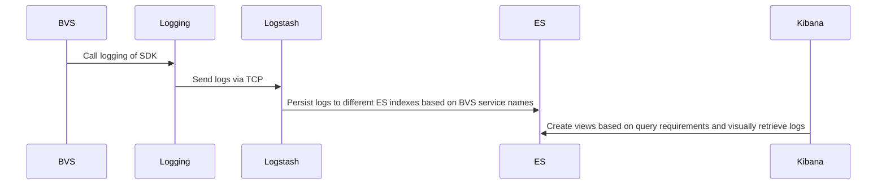

# Logging Module

## Overview

The Logging module primarily utilizes the ELK stack (Elasticsearch, Logstash, Kibana) for log management and visualization. As the system scales and logging demands increase, the architecture is designed to be flexible and can be expanded with additional components like Filebeat and Kafka for enhanced log processing and storage capabilities.

### Current and Future Architecture

The current architecture for logging follows a streamlined ELK approach:

- **Elasticsearch**: For storing and indexing logs.
- **Logstash**: For processing and forwarding logs received via TCP.
- **Kibana**: For visualizing and querying logs.

As the project grows, the architecture can be extended to include:

- **Filebeat**: To efficiently ship logs from various sources.
- **Kafka**: For buffering and managing high-throughput log streams.

### Log Flow

The following diagram illustrates the logging flow from BVS components to visualization in Kibana:



### Important Notes:

The Logstash TCP address should be configured according to the deployment environment.
The bvsName must follow specific naming conventions: it should consist of lowercase English characters, underscores, dashes, numbers, and must start with a letter.

## Kibana Access

For visual access to logs, Kibana is available at the following address (subject to final deployment configuration):

http://kibana.satlayer.net

## Logging Demo

The following Go code snippet demonstrates how to use the logging SDK. Note that the SDK is hosted in a private repository.

```go
package main

import "github.com/satlayer/satlayer-sdk/logger"

func main() {
    l := logging.NewELKLogger("bvs1")
    l.SetLogLevel("debug")
    // info demo
    l.INFO("this is a info log test")
    // warn demo
    l.WARN("this is a warn log test")
    // error demo
    l.ERROR("this is a error log test",
        logging.WithFiled("age", 100),
        logging.WithFiled("gender", "man"),
    )
    // debug demo
    l.DEBUG("this is a debug log test")
    // fatal demo
    l.FATAL("this is a fatal log test")
}
```

## Conclusion

The Logging module offers a scalable and flexible approach to log management. By leveraging the ELK stack and supporting future scalability through components like Filebeat and Kafka, this solution ensures robust log processing and visualization capabilities for both current and future needs.
